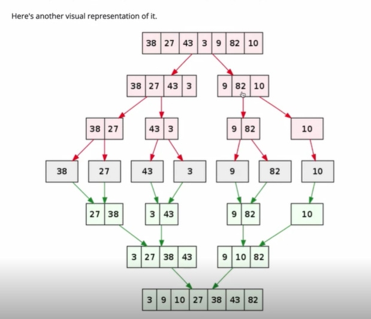
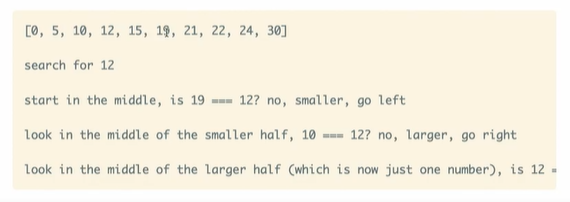

# Algorithms - Brian Holt

This is from the Front end masters course located [here](https://frontendmasters.com/courses/computer-science-v2)
These are the notes and the project that I created to follow this course. Feel free to fork this project and explore all the possibilities.

********************************

## branch1 BigO

Here we are just basically going to be discussing BigO notation

********************************

## branch 2

### BubbleSort

O(n2)
Before we do bubble sort, we are going to setup Jest.
We need to install Jest as a dev dependency first:

```js
npm install jest --save-dev
```

Now we need to add jest to our .eslintrc.json file so we dont get the error in our test files
that test and expect are undefined

```js
  "env":{
      "es6":true,
      "browser":true,
      "node":true,
      "jest": true
  },
```

There is one more thing that we need to to and that is add the prest to our .babelrc file

```js
  "presets": ["@babel/preset-env"]
```

Of course, if you don't have this plugin you will need to install it

```js
npm  install --save-dev @babel/preset-env
```

Now you should not get an error when running your tests that it doesn't like esm modules

A good video for setting up jest can be found [here](https://www.youtube.com/watch?v=ZnIv8u2-XrA)

About BubbleSort:
the biggest elements bubble to the last spot on each iteration of the array

By the way, you will probably never use bubble sort.

********************************

## branch 3

### Bubble sort for and array of objects

Now let's modify our bubble sort so we can actually use this in real life. How often are we actually trying to just sort numbers, right?
Here is what our data is going to look like:

```js
const employees = [
  {
    id: 1,
    firstName: 'chris',
    lastName: 'fowler',
    age: 27,
    job: 'cashier',
    level: 2,
    hireDate: '1/1/2020',
  },
  {
    id: 2,
    firstName: 'stan',
    lastName: 'phillips',
    age: 23,
    job: 'cashier',
    level: 2,
    hireDate: '4/1/2020',
  },
  {
    id: 3,
    firstName: 'marry',
    lastName: 'simmons',
    age: 35,
    job: 'manager',
    level: 5,
    hireDate: '3/1/2020',
  },
  {
    id: 4,
    firstName: 'alysa',
    lastName: 'mitchell',
    age: 19,
    job: 'bagger',
    level: 1,
    hireDate: '2/1/2020',
  },
  {
    id: 5,
    firstName: 'paul',
    lastName: 'jefferson',
    age: 24,
    job: 'receiver',
    level: 3,
    hireDate: '1/1/2019',
  },
  {
    id: 6,
    firstName: 'paula',
    lastName: 'sanders',
    age: 25,
    job: 'assistant',
    level: 4,
    hireDate: '7/1/2019',
  },
  {
    id: 7,
    firstName: 'brian',
    lastName: 'hold',
    age: 29,
    job: 'receiver',
    level: 3,
    hireDate: '6/1/2020',
  },
  {
    id: 8,
    firstName: 'cheryl',
    lastName: 'bowers',
    age: 22,
    job: 'cashier',
    level: 2,
    hireDate: '5/1/2019',
  },
  {
    id: 9,
    firstName: 'sandy',
    lastName: 'finkler',
    age: 26,
    job: 'cashier',
    level: 2,
    hireDate: '4/1/2019',
  },
  {
    id: 10,
    firstName: 'mike',
    lastName: 'siffler',
    age: 45,
    job: 'owner',
    level: 6,
    hireDate: '1/1/2018',
  },
];
```

we are going to be using this data for many things. By default, we are just going to be sorting by number, so let's just sort this by age first, and here is what that would look like:

```js
const sortedEmployeesByAge = [
  {
    id: 4,
    firstName: 'alysa',
    lastName: 'mitchell',
    age: 19,
    job: 'bagger',
    level: 1,
    hireDate: '2/1/2020',
  },
  {
    id: 8,
    firstName: 'cheryl',
    lastName: 'bowers',
    age: 22,
    job: 'cashier',
    level: 2,
    hireDate: '5/1/2019',
  },
  {
    id: 2,
    firstName: 'stan',
    lastName: 'phillips',
    age: 23,
    job: 'cashier',
    level: 2,
    hireDate: '4/1/2020',
  },
  {
    id: 5,
    firstName: 'paul',
    lastName: 'jefferson',
    age: 24,
    job: 'receiver',
    level: 3,
    hireDate: '1/1/2019',
  },
  {
    id: 6,
    firstName: 'paula',
    lastName: 'sanders',
    age: 25,
    job: 'assistant',
    level: 4,
    hireDate: '7/1/2019',
  },
  {
    id: 9,
    firstName: 'sandy',
    lastName: 'finkler',
    age: 26,
    job: 'cashier',
    level: 2,
    hireDate: '4/1/2019',
  },
  {
    id: 1,
    firstName: 'chris',
    lastName: 'fowler',
    age: 27,
    job: 'cashier',
    level: 2,
    hireDate: '1/1/2020',
  },
  {
    id: 7,
    firstName: 'brian',
    lastName: 'hold',
    age: 29,
    job: 'receiver',
    level: 3,
    hireDate: '6/1/2020',
  },
  {
    id: 3,
    firstName: 'marry',
    lastName: 'simmons',
    age: 35,
    job: 'manager',
    level: 5,
    hireDate: '3/1/2020',
  },
  {
    id: 10,
    firstName: 'mike',
    lastName: 'siffler',
    age: 45,
    job: 'owner',
    level: 6,
    hireDate: '1/1/2018',
  },
];
```

********************************

## branch 4

Now let try sorting using a string value. Our newly sorted data shoul look like this:

```js
const sortedEmployeesByFirstName = [
  {
    id: 4,
    firstName: 'alysa',
    lastName: 'mitchell',
    age: 19,
    job: 'bagger',
    level: 1,
    hireDate: '2/1/2020',
  },
  {
    id: 7,
    firstName: 'brian',
    lastName: 'hold',
    age: 29,
    job: 'receiver',
    level: 3,
    hireDate: '6/1/2020',
  },
  {
    id: 8,
    firstName: 'cheryl',
    lastName: 'bowers',
    age: 22,
    job: 'cashier',
    level: 2,
    hireDate: '5/1/2019',
  },
  {
    id: 1,
    firstName: 'chris',
    lastName: 'fowler',
    age: 27,
    job: 'cashier',
    level: 2,
    hireDate: '1/1/2020',
  },
  {
    id: 3,
    firstName: 'marry',
    lastName: 'simmons',
    age: 35,
    job: 'manager',
    level: 5,
    hireDate: '3/1/2020',
  },
  {
    id: 10,
    firstName: 'mike',
    lastName: 'siffler',
    age: 45,
    job: 'owner',
    level: 6,
    hireDate: '1/1/2018',
  },
  {
    id: 5,
    firstName: 'paul',
    lastName: 'jefferson',
    age: 24,
    job: 'receiver',
    level: 3,
    hireDate: '1/1/2019',
  },
  {
    id: 6,
    firstName: 'paula',
    lastName: 'sanders',
    age: 25,
    job: 'assistant',
    level: 4,
    hireDate: '7/1/2019',
  },
  {
    id: 9,
    firstName: 'sandy',
    lastName: 'finkler',
    age: 26,
    job: 'cashier',
    level: 2,
    hireDate: '4/1/2019',
  },
  {
    id: 2,
    firstName: 'stan',
    lastName: 'phillips',
    age: 23,
    job: 'cashier',
    level: 2,
    hireDate: '4/1/2020',
  },
];
```

Now let's test sorting by lastName. Our data should look like this:

```js
const sortedEmployeesByLastName = [
  {
    id: 8,
    firstName: 'cheryl',
    lastName: 'bowers',
    age: 22,
    job: 'cashier',
    level: 2,
    hireDate: '5/1/2019',
  },
  {
    id: 9,
    firstName: 'sandy',
    lastName: 'finkler',
    age: 26,
    job: 'cashier',
    level: 2,
    hireDate: '4/1/2019',
  },
  {
    id: 1,
    firstName: 'chris',
    lastName: 'fowler',
    age: 27,
    job: 'cashier',
    level: 2,
    hireDate: '1/1/2020',
  },
  {
    id: 7,
    firstName: 'brian',
    lastName: 'hold',
    age: 29,
    job: 'receiver',
    level: 3,
    hireDate: '6/1/2020',
  },
  {
    id: 5,
    firstName: 'paul',
    lastName: 'jefferson',
    age: 24,
    job: 'receiver',
    level: 3,
    hireDate: '1/1/2019',
  },
  {
    id: 4,
    firstName: 'alysa',
    lastName: 'mitchell',
    age: 19,
    job: 'bagger',
    level: 1,
    hireDate: '2/1/2020',
  },
  {
    id: 2,
    firstName: 'stan',
    lastName: 'phillips',
    age: 23,
    job: 'cashier',
    level: 2,
    hireDate: '4/1/2020',
  },
  {
    id: 6,
    firstName: 'paula',
    lastName: 'sanders',
    age: 25,
    job: 'assistant',
    level: 4,
    hireDate: '7/1/2019',
  },
  {
    id: 10,
    firstName: 'mike',
    lastName: 'siffler',
    age: 45,
    job: 'owner',
    level: 6,
    hireDate: '1/1/2018',
  },
  {
    id: 3,
    firstName: 'marry',
    lastName: 'simmons',
    age: 35,
    job: 'manager',
    level: 5,
    hireDate: '3/1/2020',
  },
];
```

********************************

## branch 5

Now let's see if we need to make any changes if we are sorting by dates. We are going to have to add dates to our data becuase we don't have any yet, but this will complete our first sorting algorithm. And our sorted data should look like this:

```js
const sortedEmployeesByDate = [
  {
    id: 10,
    firstName: 'mike',
    lastName: 'siffler',
    age: 45,
    job: 'owner',
    level: 6,
    hireDate: '1/1/2018',
  },
  {
    id: 5,
    firstName: 'paul',
    lastName: 'jefferson',
    age: 24,
    job: 'receiver',
    level: 3,
    hireDate: '1/1/2019',
  },
  {
    id: 9,
    firstName: 'sandy',
    lastName: 'finkler',
    age: 26,
    job: 'cashier',
    level: 2,
    hireDate: '4/1/2019',
  },
  {
    id: 8,
    firstName: 'cheryl',
    lastName: 'bowers',
    age: 22,
    job: 'cashier',
    level: 2,
    hireDate: '5/1/2019',
  },
  {
    id: 6,
    firstName: 'paula',
    lastName: 'sanders',
    age: 25,
    job: 'assistant',
    level: 4,
    hireDate: '7/1/2019',
  },
  {
    id: 1,
    firstName: 'chris',
    lastName: 'fowler',
    age: 27,
    job: 'cashier',
    level: 2,
    hireDate: '1/1/2020',
  },
  {
    id: 4,
    firstName: 'alysa',
    lastName: 'mitchell',
    age: 19,
    job: 'bagger',
    level: 1,
    hireDate: '2/1/2020',
  },
  {
    id: 3,
    firstName: 'marry',
    lastName: 'simmons',
    age: 35,
    job: 'manager',
    level: 5,
    hireDate: '3/1/2020',
  },
  {
    id: 2,
    firstName: 'stan',
    lastName: 'phillips',
    age: 23,
    job: 'cashier',
    level: 2,
    hireDate: '4/1/2020',
  },
  {
    id: 7,
    firstName: 'brian',
    lastName: 'hold',
    age: 29,
    job: 'receiver',
    level: 3,
    hireDate: '6/1/2020',
  },
];
```

It look's like all we needed to do was add an isDate flag to our function and then have one conditional to check for the dates

********************************

## branch 6

Now let's top off our Bubble sort by adding ascending and descending order so we can really use this in real life. Kind of a pain, but we must complete the circle.
Here is what our sorted data by age should look like:

```js
const sortedEmployeesByAgeDesc = [
  {
    id: 10,
    firstName: 'mike',
    lastName: 'siffler',
    age: 45,
    job: 'owner',
    level: 6,
    hireDate: '1/1/2018',
  },
  {
    id: 3,
    firstName: 'marry',
    lastName: 'simmons',
    age: 35,
    job: 'manager',
    level: 5,
    hireDate: '3/1/2020',
  },
  {
    id: 7,
    firstName: 'brian',
    lastName: 'hold',
    age: 29,
    job: 'receiver',
    level: 3,
    hireDate: '6/1/2020',
  },
  {
    id: 1,
    firstName: 'chris',
    lastName: 'fowler',
    age: 27,
    job: 'cashier',
    level: 2,
    hireDate: '1/1/2020',
  },
  {
    id: 9,
    firstName: 'sandy',
    lastName: 'finkler',
    age: 26,
    job: 'cashier',
    level: 2,
    hireDate: '4/1/2019',
  },
  {
    id: 6,
    firstName: 'paula',
    lastName: 'sanders',
    age: 25,
    job: 'assistant',
    level: 4,
    hireDate: '7/1/2019',
  },
  {
    id: 5,
    firstName: 'paul',
    lastName: 'jefferson',
    age: 24,
    job: 'receiver',
    level: 3,
    hireDate: '1/1/2019',
  },
  {
    id: 2,
    firstName: 'stan',
    lastName: 'phillips',
    age: 23,
    job: 'cashier',
    level: 2,
    hireDate: '4/1/2020',
  },
  {
    id: 8,
    firstName: 'cheryl',
    lastName: 'bowers',
    age: 22,
    job: 'cashier',
    level: 2,
    hireDate: '5/1/2019',
  },
  {
    id: 4,
    firstName: 'alysa',
    lastName: 'mitchell',
    age: 19,
    job: 'bagger',
    level: 1,
    hireDate: '2/1/2020',
  },
];
```

And our reverse sorted data by firstName should look like this:

```js
const sortedEmployeesByFirstNameDesc = [
  {
    id: 2,
    firstName: 'stan',
    lastName: 'phillips',
    age: 23,
    job: 'cashier',
    level: 2,
    hireDate: '4/1/2020',
  },
  {
    id: 9,
    firstName: 'sandy',
    lastName: 'finkler',
    age: 26,
    job: 'cashier',
    level: 2,
    hireDate: '4/1/2019',
  },
  {
    id: 6,
    firstName: 'paula',
    lastName: 'sanders',
    age: 25,
    job: 'assistant',
    level: 4,
    hireDate: '7/1/2019',
  },
  {
    id: 5,
    firstName: 'paul',
    lastName: 'jefferson',
    age: 24,
    job: 'receiver',
    level: 3,
    hireDate: '1/1/2019',
  },
  {
    id: 10,
    firstName: 'mike',
    lastName: 'siffler',
    age: 45,
    job: 'owner',
    level: 6,
    hireDate: '1/1/2018',
  },
  {
    id: 3,
    firstName: 'marry',
    lastName: 'simmons',
    age: 35,
    job: 'manager',
    level: 5,
    hireDate: '3/1/2020',
  },
  {
    id: 1,
    firstName: 'chris',
    lastName: 'fowler',
    age: 27,
    job: 'cashier',
    level: 2,
    hireDate: '1/1/2020',
  },
  {
    id: 8,
    firstName: 'cheryl',
    lastName: 'bowers',
    age: 22,
    job: 'cashier',
    level: 2,
    hireDate: '5/1/2019',
  },
  {
    id: 7,
    firstName: 'brian',
    lastName: 'hold',
    age: 29,
    job: 'receiver',
    level: 3,
    hireDate: '6/1/2020',
  },
  {
    id: 4,
    firstName: 'alysa',
    lastName: 'mitchell',
    age: 19,
    job: 'bagger',
    level: 1,
    hireDate: '2/1/2020',
  },
];
```

And our reverse sorted date data should look like this:

```js
const sortedEmployeesByDateDesc = [
  {
    id: 7,
    firstName: 'brian',
    lastName: 'hold',
    age: 29,
    job: 'receiver',
    level: 3,
    hireDate: '6/1/2020',
  },
  {
    id: 2,
    firstName: 'stan',
    lastName: 'phillips',
    age: 23,
    job: 'cashier',
    level: 2,
    hireDate: '4/1/2020',
  },
  {
    id: 3,
    firstName: 'marry',
    lastName: 'simmons',
    age: 35,
    job: 'manager',
    level: 5,
    hireDate: '3/1/2020',
  },
  {
    id: 4,
    firstName: 'alysa',
    lastName: 'mitchell',
    age: 19,
    job: 'bagger',
    level: 1,
    hireDate: '2/1/2020',
  },
  {
    id: 1,
    firstName: 'chris',
    lastName: 'fowler',
    age: 27,
    job: 'cashier',
    level: 2,
    hireDate: '1/1/2020',
  },
  {
    id: 6,
    firstName: 'paula',
    lastName: 'sanders',
    age: 25,
    job: 'assistant',
    level: 4,
    hireDate: '7/1/2019',
  },
  {
    id: 8,
    firstName: 'cheryl',
    lastName: 'bowers',
    age: 22,
    job: 'cashier',
    level: 2,
    hireDate: '5/1/2019',
  },
  {
    id: 9,
    firstName: 'sandy',
    lastName: 'finkler',
    age: 26,
    job: 'cashier',
    level: 2,
    hireDate: '4/1/2019',
  },
  {
    id: 5,
    firstName: 'paul',
    lastName: 'jefferson',
    age: 24,
    job: 'receiver',
    level: 3,
    hireDate: '1/1/2019',
  },
  {
    id: 10,
    firstName: 'mike',
    lastName: 'siffler',
    age: 45,
    job: 'owner',
    level: 6,
    hireDate: '1/1/2018',
  },
];
```

Now we should have a complete BubbleSort algorithm

********************************

## branch 7

### Insertion Sort

much better than BubbleSort O(n2)
This sorting method is looking at each number and determining if is greater than the next number and then recurse backwards doing the same thing. if it is bigger then they get swapped.
We are going to set up the Insertion sort to handle numbers and then generate another function to handle sorting arrays of objects by numbers, strings, and dates

********************************

## branch 9

### Recursion

We are going to do a little test with recursion to generate fibonacci numbers first and write some tests to see if they are going to pass or not.  
Then we will use recursion to do a little math

********************************

## branch 10

### Factorials

We are going to create a factorial function using recursion
 5! = 5 * 4 * 3 * 2 * 1

********************************

## branch 11

### Merge Sort

The base case is when we are left with an array of 1. We are going to split that data in half recursively until each only has an array of 1, then sort both halves. Then when we are done with that, we will merge the two back together.
Here is a diagram

Usually when you call sort in javascript, it is using the MergeSort under the hood.

********************************

## branch 12

Now we are going to first add ascending and descending order to our sort and then we are going to create a modified version for handling our data

********************************

## branch 13

### Quick Sort

This is another divide and conquire algorithm meaning that it's using a recursive approach. This is going to use a pivot which is the last entry in the array. Then we divide this into two arrays. 

```js
[4935]
-> 5 is the pivot since its last
-> divide list into two arrays, [4,3], and [9]
-> call quicksort on those two lists

[4,3]
-> 3 is the pivot
-> call quicksort on [] and [4]
-> thos both return as is because they are the base case of length of 1 or 0
-> concat [], 3, and [4]
-> return [3,4]

[9]
-> return as is because of base case of 1

(back into the original function call)
call concat on [3,4], 5, and [9]
return [2,3,4,9]
```

worst case is [1,2,3,4,5,6,7] or an already sorted array
7 is pivot and there is nothing in the right array or opposite for an already sorted array
Also this implementation is goimg to be non-destructive

```js
const QuickSort = arr => {
  // base case 0 or 1
  // get pivot, last item in the array
  // seperate into two arrays based on higher or lower
  // call quicksort on left and right
  // return concat left(pivot, right)
}
```

********************************

## branch 14

Now we are going to add ascending and descending order to our QuickSort algorithm

********************************

## branch 15

Now we are going to add the ability to QuickSort by arrays of objects

********************************

## branch 16

### Radix Sort

This sort is going to sort first by the ones place, then by the tens place, and then by the hundreds place. Strange for sure.

********************************

## branch 17

### Linear Search

This one is pretty straigh forward, we just loop through all the items in the array until we find what we are looking for.

********************************

### Binary Search

O(logn) - we don't look at all the elements in the array because we are always splitting everything in half.
This search will only work on arrays that are already sorted. This algorithm splits the data in half
This data must already be sorted for a binary search to work.


