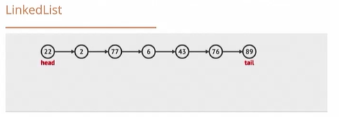

# Algorithms - Brian Holt

This is from the Front end masters course located [here](https://frontendmasters.com/courses/computer-science-v2)
These are the notes and the project that I created to follow this course. Feel free to fork this project and explore all the possibilities.

********************************

## branch1 BigO

Here we are just basically going to be discussing BigO notation

********************************

## branch 2

### BubbleSort

O(n2)
Before we do bubble sort, we are going to setup Jest.
We need to install Jest as a dev dependency first:

```js
npm install jest --save-dev
```

Now we need to add jest to our .eslintrc.json file so we dont get the error in our test files
that test and expect are undefined

```js
  "env":{
      "es6":true,
      "browser":true,
      "node":true,
      "jest": true
  },
```

There is one more thing that we need to to and that is add the prest to our .babelrc file

```js
  "presets": ["@babel/preset-env"]
```

Of course, if you don't have this plugin you will need to install it

```js
npm  install --save-dev @babel/preset-env
```

Now you should not get an error when running your tests that it doesn't like esm modules

A good video for setting up jest can be found [here](https://www.youtube.com/watch?v=ZnIv8u2-XrA)

About BubbleSort:
the biggest elements bubble to the last spot on each iteration of the array

By the way, you will probably never use bubble sort.

********************************

## branch 3

### Bubble sort for and array of objects

Now let's modify our bubble sort so we can actually use this in real life. How often are we actually trying to just sort numbers, right?
Here is what our data is going to look like:

```js
const employees = [
  {
    id: 1,
    firstName: 'chris',
    lastName: 'fowler',
    age: 27,
    job: 'cashier',
    level: 2,
    hireDate: '1/1/2020',
  },
  {
    id: 2,
    firstName: 'stan',
    lastName: 'phillips',
    age: 23,
    job: 'cashier',
    level: 2,
    hireDate: '4/1/2020',
  },
  {
    id: 3,
    firstName: 'marry',
    lastName: 'simmons',
    age: 35,
    job: 'manager',
    level: 5,
    hireDate: '3/1/2020',
  },
  {
    id: 4,
    firstName: 'alysa',
    lastName: 'mitchell',
    age: 19,
    job: 'bagger',
    level: 1,
    hireDate: '2/1/2020',
  },
  {
    id: 5,
    firstName: 'paul',
    lastName: 'jefferson',
    age: 24,
    job: 'receiver',
    level: 3,
    hireDate: '1/1/2019',
  },
  {
    id: 6,
    firstName: 'paula',
    lastName: 'sanders',
    age: 25,
    job: 'assistant',
    level: 4,
    hireDate: '7/1/2019',
  },
  {
    id: 7,
    firstName: 'brian',
    lastName: 'hold',
    age: 29,
    job: 'receiver',
    level: 3,
    hireDate: '6/1/2020',
  },
  {
    id: 8,
    firstName: 'cheryl',
    lastName: 'bowers',
    age: 22,
    job: 'cashier',
    level: 2,
    hireDate: '5/1/2019',
  },
  {
    id: 9,
    firstName: 'sandy',
    lastName: 'finkler',
    age: 26,
    job: 'cashier',
    level: 2,
    hireDate: '4/1/2019',
  },
  {
    id: 10,
    firstName: 'mike',
    lastName: 'siffler',
    age: 45,
    job: 'owner',
    level: 6,
    hireDate: '1/1/2018',
  },
];
```

we are going to be using this data for many things. By default, we are just going to be sorting by number, so let's just sort this by age first, and here is what that would look like:

```js
const sortedEmployeesByAge = [
  {
    id: 4,
    firstName: 'alysa',
    lastName: 'mitchell',
    age: 19,
    job: 'bagger',
    level: 1,
    hireDate: '2/1/2020',
  },
  {
    id: 8,
    firstName: 'cheryl',
    lastName: 'bowers',
    age: 22,
    job: 'cashier',
    level: 2,
    hireDate: '5/1/2019',
  },
  {
    id: 2,
    firstName: 'stan',
    lastName: 'phillips',
    age: 23,
    job: 'cashier',
    level: 2,
    hireDate: '4/1/2020',
  },
  {
    id: 5,
    firstName: 'paul',
    lastName: 'jefferson',
    age: 24,
    job: 'receiver',
    level: 3,
    hireDate: '1/1/2019',
  },
  {
    id: 6,
    firstName: 'paula',
    lastName: 'sanders',
    age: 25,
    job: 'assistant',
    level: 4,
    hireDate: '7/1/2019',
  },
  {
    id: 9,
    firstName: 'sandy',
    lastName: 'finkler',
    age: 26,
    job: 'cashier',
    level: 2,
    hireDate: '4/1/2019',
  },
  {
    id: 1,
    firstName: 'chris',
    lastName: 'fowler',
    age: 27,
    job: 'cashier',
    level: 2,
    hireDate: '1/1/2020',
  },
  {
    id: 7,
    firstName: 'brian',
    lastName: 'hold',
    age: 29,
    job: 'receiver',
    level: 3,
    hireDate: '6/1/2020',
  },
  {
    id: 3,
    firstName: 'marry',
    lastName: 'simmons',
    age: 35,
    job: 'manager',
    level: 5,
    hireDate: '3/1/2020',
  },
  {
    id: 10,
    firstName: 'mike',
    lastName: 'siffler',
    age: 45,
    job: 'owner',
    level: 6,
    hireDate: '1/1/2018',
  },
];
```

********************************

## branch 4

Now let try sorting using a string value. Our newly sorted data shoul look like this:

```js
const sortedEmployeesByFirstName = [
  {
    id: 4,
    firstName: 'alysa',
    lastName: 'mitchell',
    age: 19,
    job: 'bagger',
    level: 1,
    hireDate: '2/1/2020',
  },
  {
    id: 7,
    firstName: 'brian',
    lastName: 'hold',
    age: 29,
    job: 'receiver',
    level: 3,
    hireDate: '6/1/2020',
  },
  {
    id: 8,
    firstName: 'cheryl',
    lastName: 'bowers',
    age: 22,
    job: 'cashier',
    level: 2,
    hireDate: '5/1/2019',
  },
  {
    id: 1,
    firstName: 'chris',
    lastName: 'fowler',
    age: 27,
    job: 'cashier',
    level: 2,
    hireDate: '1/1/2020',
  },
  {
    id: 3,
    firstName: 'marry',
    lastName: 'simmons',
    age: 35,
    job: 'manager',
    level: 5,
    hireDate: '3/1/2020',
  },
  {
    id: 10,
    firstName: 'mike',
    lastName: 'siffler',
    age: 45,
    job: 'owner',
    level: 6,
    hireDate: '1/1/2018',
  },
  {
    id: 5,
    firstName: 'paul',
    lastName: 'jefferson',
    age: 24,
    job: 'receiver',
    level: 3,
    hireDate: '1/1/2019',
  },
  {
    id: 6,
    firstName: 'paula',
    lastName: 'sanders',
    age: 25,
    job: 'assistant',
    level: 4,
    hireDate: '7/1/2019',
  },
  {
    id: 9,
    firstName: 'sandy',
    lastName: 'finkler',
    age: 26,
    job: 'cashier',
    level: 2,
    hireDate: '4/1/2019',
  },
  {
    id: 2,
    firstName: 'stan',
    lastName: 'phillips',
    age: 23,
    job: 'cashier',
    level: 2,
    hireDate: '4/1/2020',
  },
];
```

Now let's test sorting by lastName. Our data should look like this:

```js
const sortedEmployeesByLastName = [
  {
    id: 8,
    firstName: 'cheryl',
    lastName: 'bowers',
    age: 22,
    job: 'cashier',
    level: 2,
    hireDate: '5/1/2019',
  },
  {
    id: 9,
    firstName: 'sandy',
    lastName: 'finkler',
    age: 26,
    job: 'cashier',
    level: 2,
    hireDate: '4/1/2019',
  },
  {
    id: 1,
    firstName: 'chris',
    lastName: 'fowler',
    age: 27,
    job: 'cashier',
    level: 2,
    hireDate: '1/1/2020',
  },
  {
    id: 7,
    firstName: 'brian',
    lastName: 'hold',
    age: 29,
    job: 'receiver',
    level: 3,
    hireDate: '6/1/2020',
  },
  {
    id: 5,
    firstName: 'paul',
    lastName: 'jefferson',
    age: 24,
    job: 'receiver',
    level: 3,
    hireDate: '1/1/2019',
  },
  {
    id: 4,
    firstName: 'alysa',
    lastName: 'mitchell',
    age: 19,
    job: 'bagger',
    level: 1,
    hireDate: '2/1/2020',
  },
  {
    id: 2,
    firstName: 'stan',
    lastName: 'phillips',
    age: 23,
    job: 'cashier',
    level: 2,
    hireDate: '4/1/2020',
  },
  {
    id: 6,
    firstName: 'paula',
    lastName: 'sanders',
    age: 25,
    job: 'assistant',
    level: 4,
    hireDate: '7/1/2019',
  },
  {
    id: 10,
    firstName: 'mike',
    lastName: 'siffler',
    age: 45,
    job: 'owner',
    level: 6,
    hireDate: '1/1/2018',
  },
  {
    id: 3,
    firstName: 'marry',
    lastName: 'simmons',
    age: 35,
    job: 'manager',
    level: 5,
    hireDate: '3/1/2020',
  },
];
```

********************************

## branch 5

Now let's see if we need to make any changes if we are sorting by dates. We are going to have to add dates to our data becuase we don't have any yet, but this will complete our first sorting algorithm. And our sorted data should look like this:

```js
const sortedEmployeesByDate = [
  {
    id: 10,
    firstName: 'mike',
    lastName: 'siffler',
    age: 45,
    job: 'owner',
    level: 6,
    hireDate: '1/1/2018',
  },
  {
    id: 5,
    firstName: 'paul',
    lastName: 'jefferson',
    age: 24,
    job: 'receiver',
    level: 3,
    hireDate: '1/1/2019',
  },
  {
    id: 9,
    firstName: 'sandy',
    lastName: 'finkler',
    age: 26,
    job: 'cashier',
    level: 2,
    hireDate: '4/1/2019',
  },
  {
    id: 8,
    firstName: 'cheryl',
    lastName: 'bowers',
    age: 22,
    job: 'cashier',
    level: 2,
    hireDate: '5/1/2019',
  },
  {
    id: 6,
    firstName: 'paula',
    lastName: 'sanders',
    age: 25,
    job: 'assistant',
    level: 4,
    hireDate: '7/1/2019',
  },
  {
    id: 1,
    firstName: 'chris',
    lastName: 'fowler',
    age: 27,
    job: 'cashier',
    level: 2,
    hireDate: '1/1/2020',
  },
  {
    id: 4,
    firstName: 'alysa',
    lastName: 'mitchell',
    age: 19,
    job: 'bagger',
    level: 1,
    hireDate: '2/1/2020',
  },
  {
    id: 3,
    firstName: 'marry',
    lastName: 'simmons',
    age: 35,
    job: 'manager',
    level: 5,
    hireDate: '3/1/2020',
  },
  {
    id: 2,
    firstName: 'stan',
    lastName: 'phillips',
    age: 23,
    job: 'cashier',
    level: 2,
    hireDate: '4/1/2020',
  },
  {
    id: 7,
    firstName: 'brian',
    lastName: 'hold',
    age: 29,
    job: 'receiver',
    level: 3,
    hireDate: '6/1/2020',
  },
];
```

It look's like all we needed to do was add an isDate flag to our function and then have one conditional to check for the dates

********************************

## branch 6

Now let's top off our Bubble sort by adding ascending and descending order so we can really use this in real life. Kind of a pain, but we must complete the circle.
Here is what our sorted data by age should look like:

```js
const sortedEmployeesByAgeDesc = [
  {
    id: 10,
    firstName: 'mike',
    lastName: 'siffler',
    age: 45,
    job: 'owner',
    level: 6,
    hireDate: '1/1/2018',
  },
  {
    id: 3,
    firstName: 'marry',
    lastName: 'simmons',
    age: 35,
    job: 'manager',
    level: 5,
    hireDate: '3/1/2020',
  },
  {
    id: 7,
    firstName: 'brian',
    lastName: 'hold',
    age: 29,
    job: 'receiver',
    level: 3,
    hireDate: '6/1/2020',
  },
  {
    id: 1,
    firstName: 'chris',
    lastName: 'fowler',
    age: 27,
    job: 'cashier',
    level: 2,
    hireDate: '1/1/2020',
  },
  {
    id: 9,
    firstName: 'sandy',
    lastName: 'finkler',
    age: 26,
    job: 'cashier',
    level: 2,
    hireDate: '4/1/2019',
  },
  {
    id: 6,
    firstName: 'paula',
    lastName: 'sanders',
    age: 25,
    job: 'assistant',
    level: 4,
    hireDate: '7/1/2019',
  },
  {
    id: 5,
    firstName: 'paul',
    lastName: 'jefferson',
    age: 24,
    job: 'receiver',
    level: 3,
    hireDate: '1/1/2019',
  },
  {
    id: 2,
    firstName: 'stan',
    lastName: 'phillips',
    age: 23,
    job: 'cashier',
    level: 2,
    hireDate: '4/1/2020',
  },
  {
    id: 8,
    firstName: 'cheryl',
    lastName: 'bowers',
    age: 22,
    job: 'cashier',
    level: 2,
    hireDate: '5/1/2019',
  },
  {
    id: 4,
    firstName: 'alysa',
    lastName: 'mitchell',
    age: 19,
    job: 'bagger',
    level: 1,
    hireDate: '2/1/2020',
  },
];
```

And our reverse sorted data by firstName should look like this:

```js
const sortedEmployeesByFirstNameDesc = [
  {
    id: 2,
    firstName: 'stan',
    lastName: 'phillips',
    age: 23,
    job: 'cashier',
    level: 2,
    hireDate: '4/1/2020',
  },
  {
    id: 9,
    firstName: 'sandy',
    lastName: 'finkler',
    age: 26,
    job: 'cashier',
    level: 2,
    hireDate: '4/1/2019',
  },
  {
    id: 6,
    firstName: 'paula',
    lastName: 'sanders',
    age: 25,
    job: 'assistant',
    level: 4,
    hireDate: '7/1/2019',
  },
  {
    id: 5,
    firstName: 'paul',
    lastName: 'jefferson',
    age: 24,
    job: 'receiver',
    level: 3,
    hireDate: '1/1/2019',
  },
  {
    id: 10,
    firstName: 'mike',
    lastName: 'siffler',
    age: 45,
    job: 'owner',
    level: 6,
    hireDate: '1/1/2018',
  },
  {
    id: 3,
    firstName: 'marry',
    lastName: 'simmons',
    age: 35,
    job: 'manager',
    level: 5,
    hireDate: '3/1/2020',
  },
  {
    id: 1,
    firstName: 'chris',
    lastName: 'fowler',
    age: 27,
    job: 'cashier',
    level: 2,
    hireDate: '1/1/2020',
  },
  {
    id: 8,
    firstName: 'cheryl',
    lastName: 'bowers',
    age: 22,
    job: 'cashier',
    level: 2,
    hireDate: '5/1/2019',
  },
  {
    id: 7,
    firstName: 'brian',
    lastName: 'hold',
    age: 29,
    job: 'receiver',
    level: 3,
    hireDate: '6/1/2020',
  },
  {
    id: 4,
    firstName: 'alysa',
    lastName: 'mitchell',
    age: 19,
    job: 'bagger',
    level: 1,
    hireDate: '2/1/2020',
  },
];
```

And our reverse sorted date data should look like this:

```js
const sortedEmployeesByDateDesc = [
  {
    id: 7,
    firstName: 'brian',
    lastName: 'hold',
    age: 29,
    job: 'receiver',
    level: 3,
    hireDate: '6/1/2020',
  },
  {
    id: 2,
    firstName: 'stan',
    lastName: 'phillips',
    age: 23,
    job: 'cashier',
    level: 2,
    hireDate: '4/1/2020',
  },
  {
    id: 3,
    firstName: 'marry',
    lastName: 'simmons',
    age: 35,
    job: 'manager',
    level: 5,
    hireDate: '3/1/2020',
  },
  {
    id: 4,
    firstName: 'alysa',
    lastName: 'mitchell',
    age: 19,
    job: 'bagger',
    level: 1,
    hireDate: '2/1/2020',
  },
  {
    id: 1,
    firstName: 'chris',
    lastName: 'fowler',
    age: 27,
    job: 'cashier',
    level: 2,
    hireDate: '1/1/2020',
  },
  {
    id: 6,
    firstName: 'paula',
    lastName: 'sanders',
    age: 25,
    job: 'assistant',
    level: 4,
    hireDate: '7/1/2019',
  },
  {
    id: 8,
    firstName: 'cheryl',
    lastName: 'bowers',
    age: 22,
    job: 'cashier',
    level: 2,
    hireDate: '5/1/2019',
  },
  {
    id: 9,
    firstName: 'sandy',
    lastName: 'finkler',
    age: 26,
    job: 'cashier',
    level: 2,
    hireDate: '4/1/2019',
  },
  {
    id: 5,
    firstName: 'paul',
    lastName: 'jefferson',
    age: 24,
    job: 'receiver',
    level: 3,
    hireDate: '1/1/2019',
  },
  {
    id: 10,
    firstName: 'mike',
    lastName: 'siffler',
    age: 45,
    job: 'owner',
    level: 6,
    hireDate: '1/1/2018',
  },
];
```

Now we should have a complete BubbleSort algorithm

********************************

## branch 7

### Insertion Sort

much better than BubbleSort O(n2)
This sorting method is looking at each number and determining if is greater than the next number and then recurse backwards doing the same thing. if it is bigger then they get swapped.
We are going to set up the Insertion sort to handle numbers and then generate another function to handle sorting arrays of objects by numbers, strings, and dates

********************************

## branch 9

### Recursion

We are going to do a little test with recursion to generate fibonacci numbers first and write some tests to see if they are going to pass or not.  
Then we will use recursion to do a little math

********************************

## branch 10

### Factorials

We are going to create a factorial function using recursion
 5! = 5 * 4 * 3 * 2 * 1

********************************

## branch 11

### Merge Sort

The base case is when we are left with an array of 1. We are going to split that data in half recursively until each only has an array of 1, then sort both halves. Then when we are done with that, we will merge the two back together.
Here is a diagram

Usually when you call sort in javascript, it is using the MergeSort under the hood.

********************************

## branch 12

Now we are going to first add ascending and descending order to our sort and then we are going to create a modified version for handling our data

********************************

## branch 13

### Quick Sort

This is another divide and conquire algorithm meaning that it's using a recursive approach. This is going to use a pivot which is the last entry in the array. Then we divide this into two arrays. 

```js
[4935]
-> 5 is the pivot since its last
-> divide list into two arrays, [4,3], and [9]
-> call quicksort on those two lists

[4,3]
-> 3 is the pivot
-> call quicksort on [] and [4]
-> thos both return as is because they are the base case of length of 1 or 0
-> concat [], 3, and [4]
-> return [3,4]

[9]
-> return as is because of base case of 1

(back into the original function call)
call concat on [3,4], 5, and [9]
return [2,3,4,9]
```

worst case is [1,2,3,4,5,6,7] or an already sorted array
7 is pivot and there is nothing in the right array or opposite for an already sorted array
Also this implementation is goimg to be non-destructive

```js
const QuickSort = arr => {
  // base case 0 or 1
  // get pivot, last item in the array
  // seperate into two arrays based on higher or lower
  // call quicksort on left and right
  // return concat left(pivot, right)
}
```

********************************

## branch 14

Now we are going to add ascending and descending order to our QuickSort algorithm

********************************

## branch 15

Now we are going to add the ability to QuickSort by arrays of objects

********************************

## branch 16

### Radix Sort

This sort is going to sort first by the ones place, then by the tens place, and then by the hundreds place. Strange for sure.

********************************

## branch 17

### Linear Search

This one is pretty straigh forward, we just loop through all the items in the array until we find what we are looking for.

********************************

## branch 18

### Binary Search

O(logn) - we don't look at all the elements in the array because we are always splitting everything in half.
This search will only work on arrays that are already sorted. This algorithm splits the data in half
This data must already be sorted for a binary search to work.


********************************

## branch 19

Let's first go back and make a small correction to the binarySearch because we did return a result if the search was not found. We should probably add another test case for that as well, but oh well.

Now onto this branches business:

### ArrayList

suppose we did not have an array in javascript. How would we go about implementing this ourselves. Let's take a look at that.

```js
const array = {}
array[0] = 1
array[1] = 2
array[2] = 3
```

This makes lookups super fast, but deleting is terrible. Let's look at deleting index 0

```js
array[0] = array[1]
array[1] = array[2]
delete array[2]
```

This is terrible right? ArrayList is only good for adding things to the end or looking things up, righ?
So, let's implement this thing

********************************

## branch 20

### LinkedLists



[Link Here is a link to a demo](https://visualgo.net/en/list)


********************************

## branch 21

Now let's play around with linked lists and objects

********************************

## branch 22

First let's fix a bug that was found in LinkedList, we need to set the tail to null when there is no head.

Addendum...

### BinarySearchTree

There are many varities of tree data structures. We'll look at two of them in this course, Binary search tree and AVL trees. IN BST's, the node can only have two children. These trees have a mathematical property where all children that are smaller go on the left side and all children that are larger go on the right side:


Let's write some tests and get started.

Our Test results should look like this:


********************************

## branch 23

### AVL Tree

An AVL Tree is a self balancing BinarySearchTree. This helps in a case where the array was already sorted and our tree would end up looking something like this:


This would be very im-performant, right? If we need to do a search for 10, we woud have to go through every element of the array to get there. That being said, I don't think we would ever use this in production, but it's interesting to know about.

This is how the balancing works:


Out final output will look like this:


********************************

## branch 25

### Depth First Search Tree traversal

Let's say we had this tree:


With DFS the output would be
preorder output
[8,3,1,6,4,7,10,14,13]

inorder output
[1,3,4,6,7,8,10,14,13]

postorder output
[1,4,7,6,3,13,14,10,8]

The tree in our tests should look something like this:


********************************

## branch 26

### Breadth First Search Traversal

Let's say we had this tree:


In a breadth first search we recurse level by level

[8,3,10,1,6,14,4,7,13]

For this, we are going to be using a queue. FIFO.

```js
-> start function by adding root to the queue, queue = [8]
-> process 8, add to final array array = [8]
-> queue 3 and 10 to queue, queue = [3, 10]
-> dequeue 3, queue = [10]
-> queue 3's children, queue = [10, 1, 6]
-> add 3 to final array, array = [8, 3]
-> dequeue 10, queue = [1, 6]
-> queue 10's children, queue = [1, 6, 14]
-> add 10 to final array, array = [8, 3, 10]
-> dequeue 1, queue = [6, 14]
-> queue 1's children, nothing
-> add 1 to final array, [8, 3, 10, 1]

[etc.]

final array is [8, 3, 10, 1, 6, 14, 4, 7, 13]
```

The tree in our tests looks like this:


********************************

## branch 27

### Heap Sort

A Head is an array that represents a data structure. 

A priority queue is a normal queue that when you queue something it has a priority associated with it. Things that are higher priority are dequeued first. Think of your Internet traffic and how it handles data packets. If you're both syncing your Dropbox and watching Netflix, the Netflix packets would be higher priority because if you drop those the video stutters whereas the Dropbox stuff can happen whenever and you'd never notice. This would be well modeled as a priority queue. And those are usually stored as heaps.

Anyting lower in the tree must be smaller.

The way to represent a binary tree as an array is that for any index of an array n, its left child is stored at 2n + 1; and its right child is at 2n + 2. The root node will always be at 0. That means the root node's left child is at 1 and right child is at 2. 1's left child is at 3 and right is at 4.


[BigO cheatsheet](https://www.bigocheatsheet.com/)

********************************

## branch 28

### Graphs

Graphs are used for relationships. An edge is what connects objects. 

```js
   Bob — Sally
  /    \
me    Alice
  \    /
   Maria

-> Add me to queue
-> Dequeue me
-> Add my job to the tally (program manager)
-> Queue my connections, Bob and Maria
-> Dequeue Bob
-> Add Bobs job to the tally (designer)
-> Queue Bobs connection, Sally and Alice
-> Dequeue Maria
-> Add Marias job to the tally (program manager)
-> Queue Marias connections. Alice has already been queued so dont add any.

-> Finish first iteration, one degree of separation
```

********************************

## branch 29

### Pathfinding

Let's take what we've learned and go a step further. Imagine you have a 6 by 6 grid. You have point A at [1,1] and point B at [2,6]. ([0, 0] is top left.)

```js
• • • • • •
• A • • • •
• • • • • •
• • • • • •
• • • • • •
• • B • • •
```

How would you write code that finds the shortest path between A and B (no diagonals.) You could probably write some variant of looking to see if yA (the y of the A coordinate) is less than yB (y of the B coordinate). If it is, move one square from yA to yB. Rinse and repeat for the x axis. This works and given the current constraint will find you one of the shortest paths. It'd look something like:

```js
• • • • • •
• A • • • •
• 1 • • • •
• 2 • • • •
• 3 • • • •
• 4 5 • • •
```

Now let's add a wall to the mix.

```js
• • • • • •
• A • • • •
• • • • • •
• X X X X X
• • • • • •
• • B • • •
```

Suddenly our algorithm falls apart. You could probably devise some strategy to mitigate this but we can keep making more complicated wall structures to make it harder. So let's try something different: Dijkstra's algorithm.

The basic gist of Dijkstra's algorithm is that we'll start at both the beginning and the end node and begin "spiraling" outwards, marking each node with how far away it is from from its original Node. We'll alternate spiraling one level with one node, and then one level with the other. After one iteration of the point A (doesn't matter if you start with the A or B) it'd look like:

```js
• 1 • • • •
1 A 1 • • •
• 1 • • • •
• X X X X X
• • • • • •
• • B • • •
```

Then we'd do the same to point B which would like this:

```js
• 1 • • • •
1 A 1 • • •
• 1 • • • •
• X X X X X
• • 1 • • •
• 1 B 1 • •
```

We'll do this until we intersect the two spirals. As soon as the spiral intersect we know we've found the shortest possible path. Let's keep going with point A:

```js
2 1 2 • • •
1 A 1 2 • •
2 1 2 • • •
• X X X X X
• • 1 • • •
• 1 B 1 • •
```

Notice this algorithm accounts for obstacles: if there's an obstacle, you just skip that node and keep going.

Now point B:

```js
2 1 2 • • •
1 A 1 2 • •
2 1 2 • • •
• X X X X X
• 2 1 2 • •
2 1 B 1 2 •
```

You get the point, we alternate. So let's do the next steps for both point A and B.

```js
2 1 2 3 • •
1 A 1 2 3 •
2 1 2 3 • •
3 X X X X X
3 2 1 2 3 •
2 1 B 1 2 3
```

So, given this as the basic gist, let's speak about the more technical details. The way to accomplish is very similar to what we just did with tree traversals. In fact it's literally the same algorithm applied a different way. Let's take point A and reimagine it as a tree.

```js
        A [1,1]
     /  /     \   \
[1,0] [0,1] [1,2] [2,1]
/| |\ /| |\ /| |\ /| |\
  [lots more children]
```

[Visualizer](https://qiao.github.io/PathFinding.js/visual)

Go to Breadth-First-Search, uncheck Allow Diagonal and check bi-directional and press Restart Search

[What is the difference between BFS and Dijkstras algorithms when looking for the shortest path](https://stackoverflow.com/questions/25449781/what-is-difference-between-bfs-and-dijkstras-algorithms-when-looking-for-shorte)

********************************

## branch 32

We were finally able to solve all of our tests. This one took me through the ringer.

********************************

## branch 33

### Tries

This is play on words for Re***trie***ve
It's a tree that's optimized for searching in things like type-ahead.
Why is this useful? If a user types bo in the text input, you can go through your data structure, find the o node in that chain, and then all you have to do is a depth-first traversal of the children nodes to for a list of autocomplete suggestions.

```js
  a – [various children]
 /
b – o – s – t – o – n
     \
      i – s – e
```

For this exercise, we are going to install lodash
[notes on lodash.intersection](https://www.geeksforgeeks.org/lodash-_-intersection-method/)
